# NBA Sports Betting ML


---

## Description

This AI system utilizes machine learning techniques to make predictions about NBA game outcomes, including identifying potential winners and predicting whether games will have over/under scores. The system analyzes data from all teams in the NBA dating back to the 2011-12 season, and combines this information with odds for current games to generate predictions using a neural network model. The system achieves an accuracy rate of approximately 57% for moneyline bets and approximately 49% for under/over bets. In addition to identifying winners and losers, the system also provides insight into the expected value of moneyline bets for individual teams.

---

## Dictionary of Terms Used in this Repository
* Home Team ["Home_Team"]
    * The team who is hosting the basketball game at their home stadium.
* Away Team ["Away_Team"]
    * The team who is traveling to the home team's stadium to play the game.
* Game Total Points ["Game_Total_Points"]
    * The total amount of points scored in a game: Home team's total points PLUS away team's total points.
* Over/Under ["Over_Under"]
    * A group of people who work for the NBA decide on the most likely amount of game total points that any given game will have BEFORE the game is played.
    * A fan would use this to place a bet on whether they believe the actual game total points will be over or under the amount that the group of people predicted.
* Spread ["Spread"]
    * Every game, one team will be favored to win. The spread is the amount of total points that the team which is favored to win is predicted to win by over the other team.
* Moneyline ["Moneyline_Home_Team", "Moneyline_Away_Team"]
    * The same group of people as above predicts which team is going to outright win the game. A positive moneyline score means that the team is NOT predicted to win and a negative moneyline score means that the team is favored to win that particular game.
* Win Margin ["Win_Margin"]
    * The amount of points that the home team won or lost the game by (not a prediction, this is the actual true data taken after the game ends).
    * A positive number means the home team won by that many points and a negative number means the home team lost by that many points.

---

## Table of Contents

- [NBA Sports Betting ML](#nba-sports-betting-ml)
  - [Description](#description)
  - [Dictionary of Terms Used in this Repository](#dictionary-of-terms-used-in-this-repository)
  - [Table of Contents](#table-of-contents)
  - [Over/Under Model](#overunder-model)
    - [Model 1 Accuracy \& Loss Plots](#model-1-accuracy--loss-plots)
    - [Predictions for Model 1](#predictions-for-model-1)
    - [Model 2 Accuracy \& Loss Plots](#model-2-accuracy--loss-plots)
    - [Predictions for Model 2](#predictions-for-model-2)
    - [Model 3 Accuracy \& Loss Plots](#model-3-accuracy--loss-plots)
    - [Predictions for Model 3](#predictions-for-model-3)
    - [Model 4 Accuracy \& Loss Plots](#model-4-accuracy--loss-plots)
    - [Predictions for Model 4](#predictions-for-model-4)
  - [Moneyline Model](#moneyline-model)
    - [Model 1 Accuracy \& Loss Plots](#model-1-accuracy--loss-plots-1)
    - [Predictions for Model 1](#predictions-for-model-1-1)
    - [Model 2 Accuracy \& Loss Plots](#model-2-accuracy--loss-plots-1)
    - [Predictions for Model 2](#predictions-for-model-2-1)
    - [Model 3 Accuracy \& Loss Plots](#model-3-accuracy--loss-plots-1)
    - [Predictions for Model 3](#predictions-for-model-3-1)
    - [Model 4 Accuracy \& Loss Plots](#model-4-accuracy--loss-plots-1)
    - [Predictions for Model 4](#predictions-for-model-4-1)
  - [1. Installation](#1-installation)
  - [2. Usage](#2-usage)
  - [3. License](#3-license)
  - [4. Contributing](#4-contributing)
  - [5. Tests](#5-tests)
  - [6. Deployment](#6-deployment)
  - [7. Contact](#7-contact)

---

## Over/Under Model
### Model 1 Accuracy & Loss Plots
- 10 seasons of data from 2011 to 2021
- Hidden Layers: 3
- Hidden Layer Activation: LeakyReLU
- Epochs: 80
- Optimizer: Adam
- Outer Layer Activation: Linear
- Loss: Mean Squared Error (MSE)

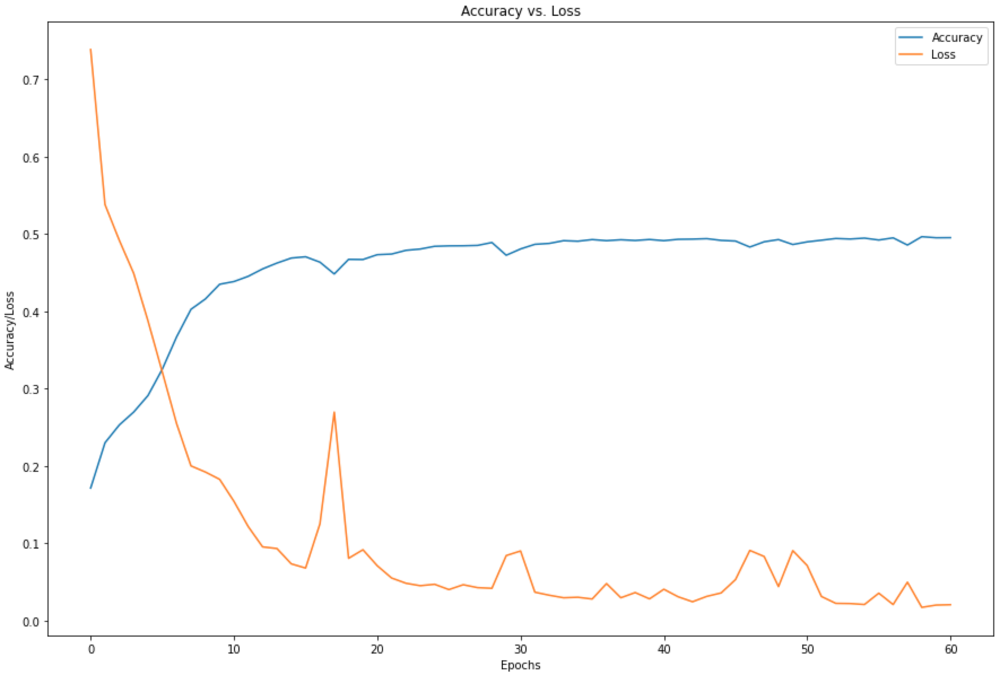

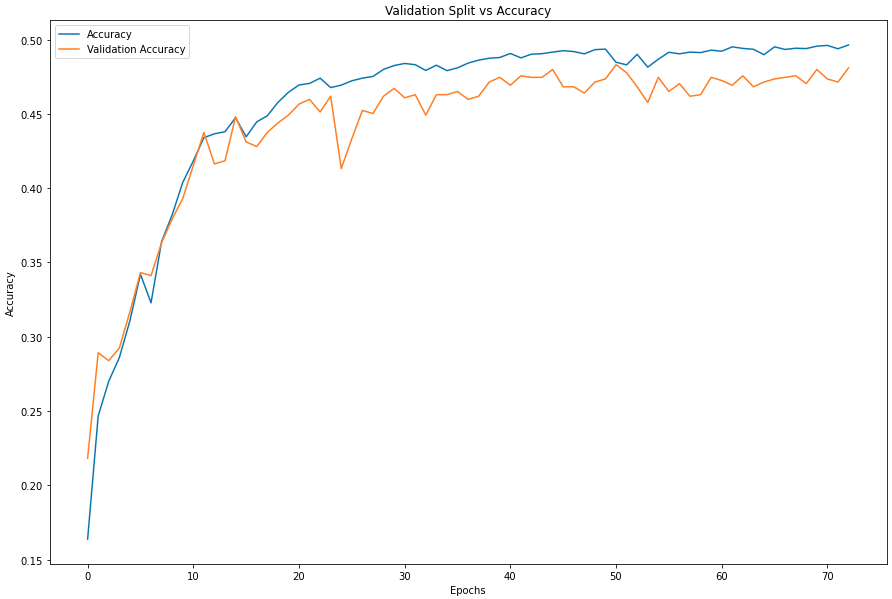

### Predictions for Model 1
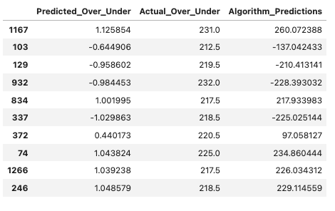

The 'accuracy vs loss' graph displays the blue line for accuracy and the orange line for loss, which are both behaving appropriately. The accuracy line is leveling out to 1, while the loss line is leveling out to 0. It is normal to observe a few spikes in the graph.

Onto the second graph 'accuracy vs validation accuracy'. Accuracy refers to the model's performance on the training dataset, which is the dataset used to train the model. It measures how well the model fits the training data and is optimized for the training set.

On the other hand, validation accuracy measures the model's performance on a dataset that the model has not seen during training. This dataset is typically used to evaluate the model's ability to generalize to new data, and it is important for determining if the model is overfitting or underfitting.

As you can see our model does a pretty good job at predicting who will win in the future games. The accuracy and validation accuracy follows each other fairly closely.


### Model 2 Accuracy & Loss Plots
- 5 seasons of data from 2016-2021
- Hidden Layers: 3
- Hidden Layer Activation: LeakyReLU
- Epochs: 130
- Optimizer: Adam
- Outer Layer Activation: Linear
- Loss: MSE

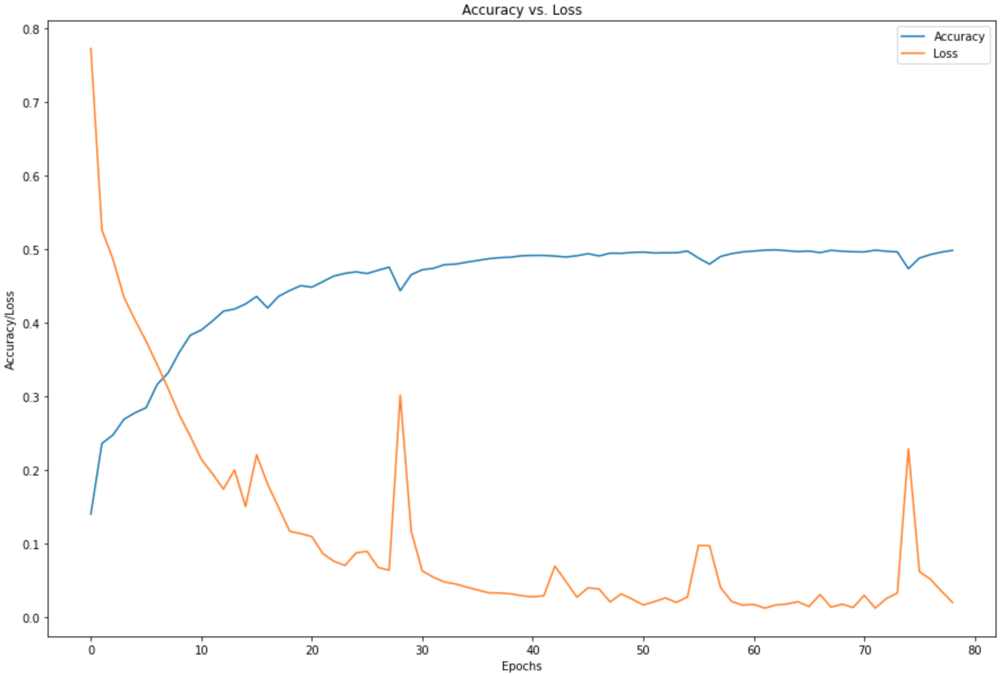


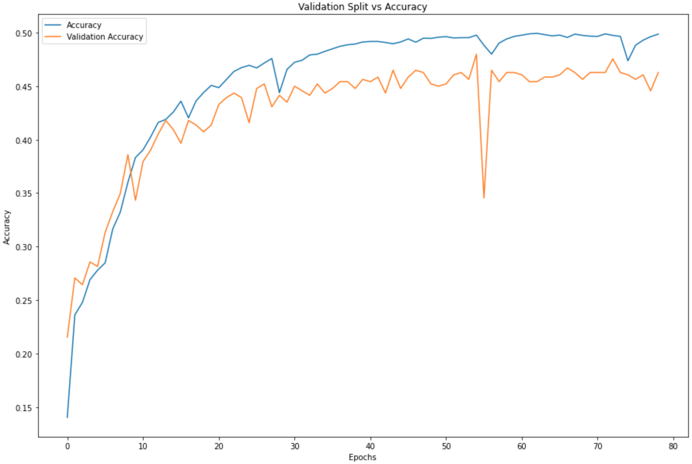

### Predictions for Model 2
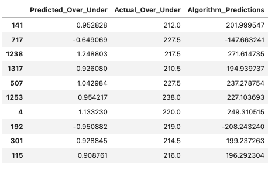

It's not surprising to see that the second model, which uses less data, doesn't perform as well as the first model. This is because having more data usually allows the model to learn more patterns and generalize better to new data.

When a model is trained on a smaller dataset, it is more likely to overfit to the training data, meaning it may perform well on the training data but not generalize well to new, unseen data. This is likely why the second model is showing less accuracy and less correlation between the loss and validation accuracy.

Though the performance isn't as good as the first model this model is still working well with the data it has.


### Model 3 Accuracy & Loss Plots
- 10 seasons of data from 2011 to 2021
- Hidden Layers: 4
- Hidden Layer Activation: LeakyReLU
- Epochs: 100
- Optimizer: Adam
- Outer Layer Activation: Linear
- Loss: MSE

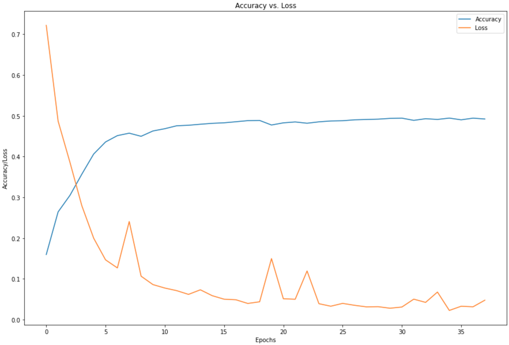


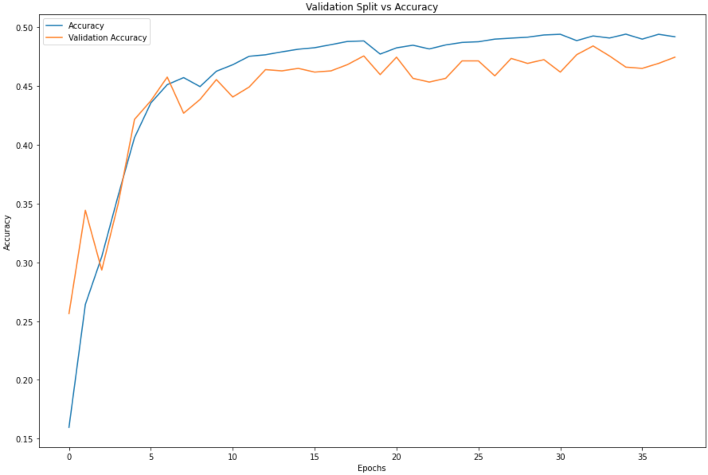

### Predictions for Model 3
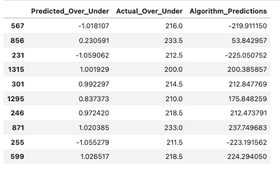

The third model has a very similar outcome as the first model. The first model had a loss of .0796 and an accuracy of .4771 while the third model has a loss of .0990 and an accuracy of .4787. The accuracy and validation accuracy are performing accurately together.

It's great to hear that the third model has a similar outcome to the first model, despite having some differences in the loss and accuracy values. The first model had a loss of (.0796) and an accuracy of (.4771) while the third model has a loss of (.0990) and an accuracy of (.4787).

The fact that the accuracy and validation accuracy are both high and close to each other indicates that the model is not overfitting to the training data and is able to generalize well to new data. The loss value is also reasonable, as it indicates how well the model is fitting the data.

Overall, it's great that the third model is showing promising results, and it may be worth further exploring its performance on new data or tweaking some of its parameters to see if it can be improved even further.

### Model 4 Accuracy & Loss Plots
- 5 seasons of data from 2016 to 2021
- Hidden Layers: 4
- Hidden Layer Activation: LeakyReLU
- Epochs: 60
- Optimizer: Adam
- Outer Layer Activation: Linear
- Loss: MSE

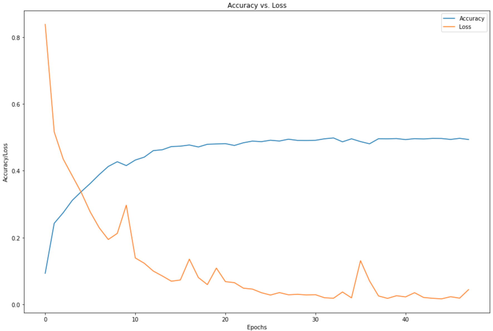

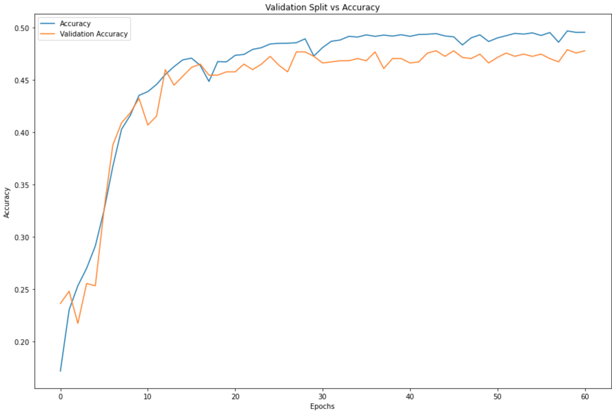

### Predictions for Model 4
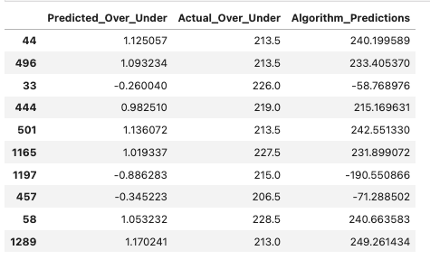

While model 4 may not have performed as well as model 1 and model 3 in terms of loss, its loss is still quite low and may be considered acceptable for the task at hand.
Additionally, it's worth noting that sometimes a model with a slightly higher loss may still perform better on unseen data, as it may have learned to generalize better.

---

## Moneyline Model
### Model 1 Accuracy & Loss Plots
- 10 seasons of data from 2011 to 2021
- Hidden Layers: 3
- Hidden Layer Activation: LeakyReLU
- Epochs: 80
- Optimizer: Adam
- Outer Layer Activation: Linear
- Loss: Mean Squared Error (MSE)

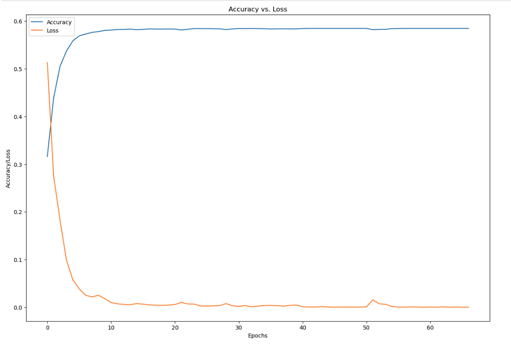

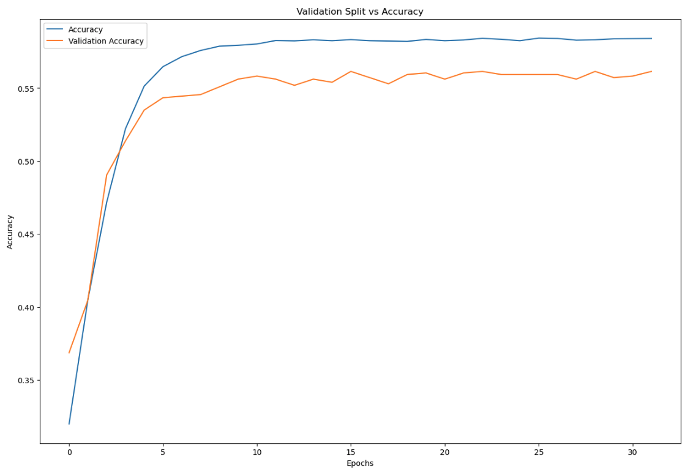

### Predictions for Model 1
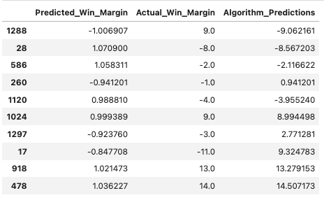

### Model 2 Accuracy & Loss Plots
- 5 seasons of data from 2016-2021
- Hidden Layers: 3
- Hidden Layer Activation: LeakyReLU
- Epochs: 130
- Optimizer: Adam
- Outer Layer Activation: Linear
- Loss: MSE

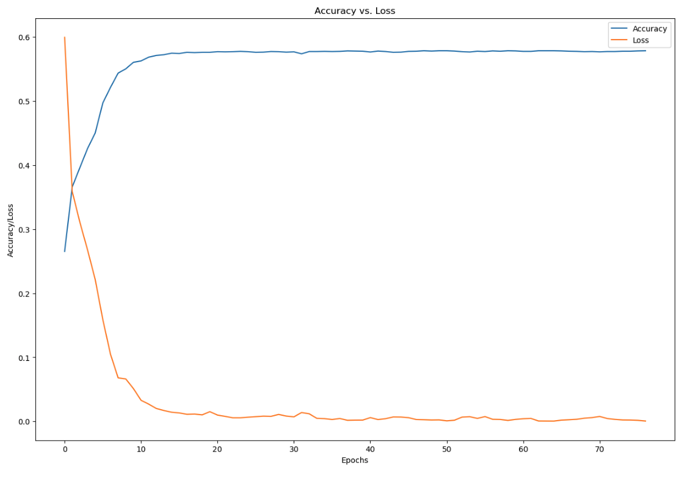

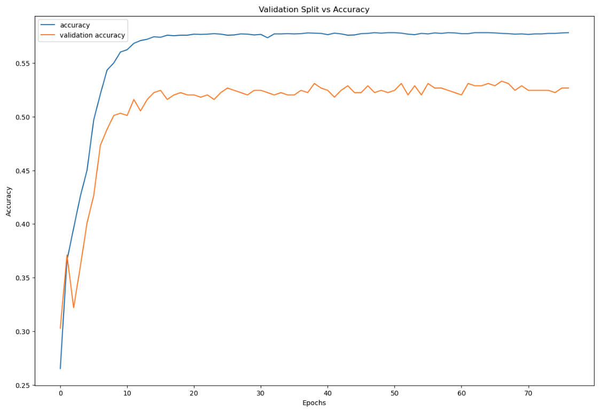

### Predictions for Model 2


### Model 3 Accuracy & Loss Plots
- 10 seasons of data from 2011 to 2021
- Hidden Layers: 4
- Hidden Layer Activation: LeakyReLU
- Epochs: 100
- Optimizer: Adam
- Outer Layer Activation: Linear
- Loss: MSE

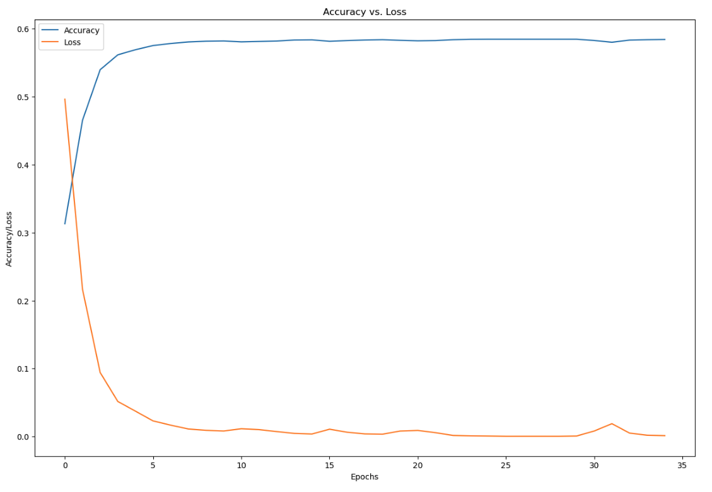

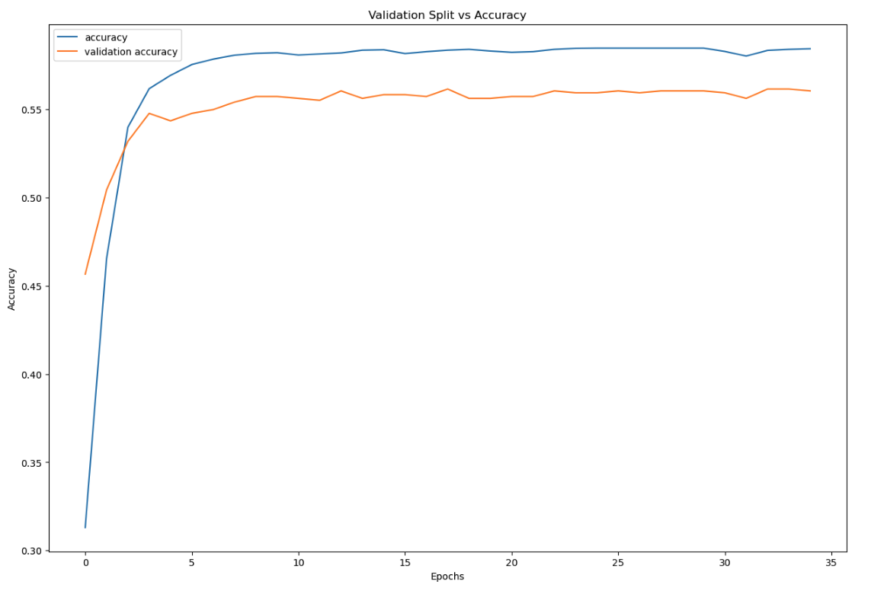

### Predictions for Model 3
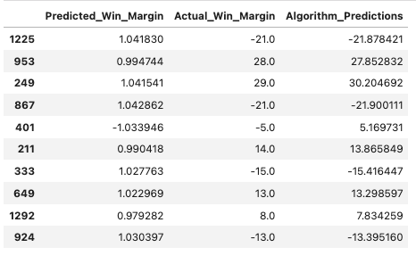

### Model 4 Accuracy & Loss Plots
- 5 seasons of data from 2016 to 2021
- Hidden Layers: 4
- Hidden Layer Activation: LeakyReLU
- Epochs: 60
- Optimizer: Adam
- Outer Layer Activation: Linear
- Loss: MSE

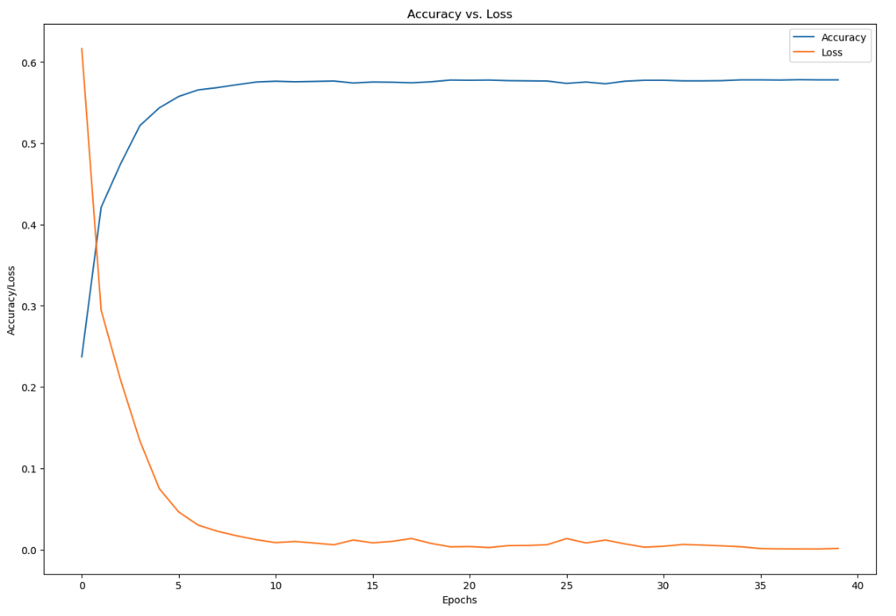

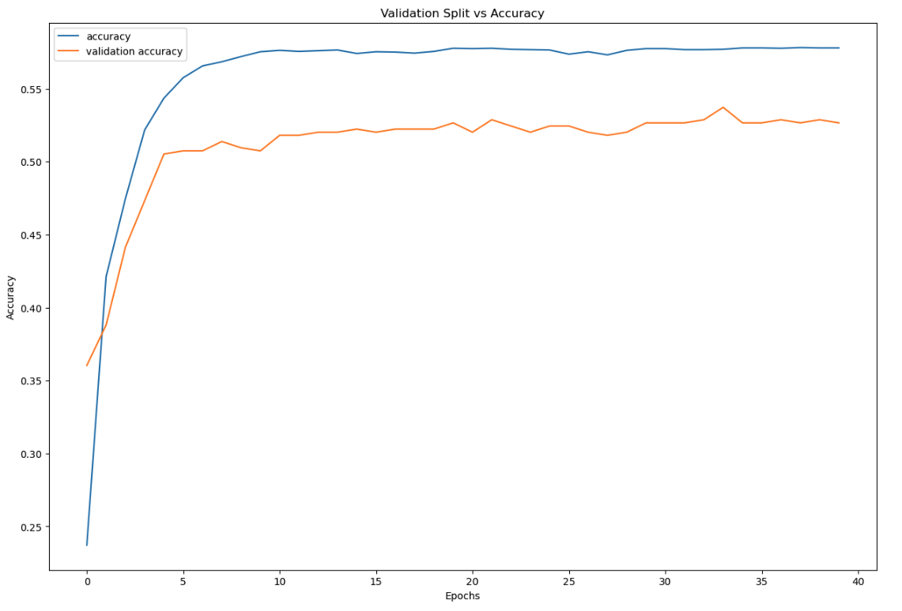

### Predictions for Model 4
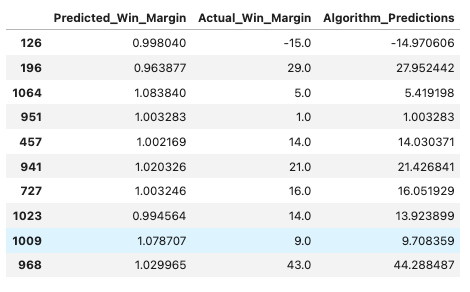

Based on the validation split versus accuracy plot, it is evident that plot 1 outperforms the other plots with its exceptional performance. Plot 1 demonstrates a close alignment between validation accuracy and the accuracy line. While plot 2 has some initial overfitting, it shows a good recovery. Plot 3 initially overfits, followed by a recovery, and then starts to underfit. Plot 4 also has some initial overfitting but shows a good recovery. However, overall, plot 1 emerges as the winner in this comparison.

---

## 1. Installation

  If you would like to clone the repository, type "git clone https://github.com/kheller18/nba-sports-betting-ml.git".
  In the terminal, with the conda dev environment activated, install the following packages and dependencies before running the NBA Machine Learning application. To understand how to install these, refer to the [Usage](#2-usage)

  * [csv](https://docs.python.org/3/library/csv.html) - Used to store all of our data

  * [Jupyter Lab](https://jupyterlab.readthedocs.io/en/stable/) - *version 3.4.4* - Used to create and share documents that contain live code, equations, visualizations and narrative text.

  * [pandas](https://pandas.pydata.org/docs/) - For the analysis of NBA data.

  * [pathlib](https://docs.python.org/3/library/pathlib.html) - *version 1.0.1* - This was used to locate through the directory or file path.

  * [TensorFlow 2.0](https://www.tensorflow.org/) - An end-to-end machine learning platform

  * [Keras](https://keras.io/about/) - Keras is a popular deep learning framework that serves as a high-level API for TensorFlow

  * [Scikit-Learn](https://scikit-learn.org/stable/index.html) - Tools for data predictions and analysis

  * [NumPy](https://numpy.org/doc/stable/index.html) - Package for scientific computing

---

## 2. Usage

  After cloning the repository locally, you'll need to have the packages listed in [Installation](#1-installation) installed on your machine. To do so, you'll need to activate your conda dev environment and running the following commands:

      ```
      pip install pandas
      pip install jupyterlab
      pip install --upgrade tensorflow
      pip install -U scikit-learn
      pip install numpy
      ```

  After all of these are installed, please refer to the [Deployment](#6-deployment) section for instructions on how to view or edit the notebook.

---

## 3. License
  ```
  MIT License

  Copyright (c) 2023 Keenan Heller | Olga Ortega | Audell Sabeti | Ariana Moreno | Rachel Hodson

  Permission is hereby granted, free of charge, to any person obtaining a copy
  of this software and associated documentation files (the "Software"), to deal
  in the Software without restriction, including without limitation the rights
  to use, copy, modify, merge, publish, distribute, sublicense, and/or sell
  copies of the Software, and to permit persons to whom the Software is
  furnished to do so, subject to the following conditions:

  The above copyright notice and this permission notice shall be included in all
  copies or substantial portions of the Software.

  THE SOFTWARE IS PROVIDED "AS IS", WITHOUT WARRANTY OF ANY KIND, EXPRESS OR
  IMPLIED, INCLUDING BUT NOT LIMITED TO THE WARRANTIES OF MERCHANTABILITY,
  FITNESS FOR A PARTICULAR PURPOSE AND NONINFRINGEMENT. IN NO EVENT SHALL THE
  AUTHORS OR COPYRIGHT HOLDERS BE LIABLE FOR ANY CLAIM, DAMAGES OR OTHER
  LIABILITY, WHETHER IN AN ACTION OF CONTRACT, TORT OR OTHERWISE, ARISING FROM,
  OUT OF OR IN CONNECTION WITH THE SOFTWARE OR THE USE OR OTHER DEALINGS IN THE
  SOFTWARE.
  ```
---

## 4. Contributing

  + [Keenan Heller](https://github.com/kheller18)
  + [Rachel Hodson](https://github.com/rachelannhodson)
  + [Ariana Moreno](https://github.com/arianamoreno13)
  + [Olga Ortega](https://github.com/olgaortega5)
  + [Audell Sabeti](https://github.com/asabeti)

---

## 5. Tests

  + There are currently no tests associated with this project.

---

## 6. Deployment
  + There is currently no live deployment of this notebook on a common server, but the user has the ability to run this notebook locally on their machine via:
    + `Jupyter Lab`: Navigate to the root directory and type "jupyter lab NN_Win_Margin.ipynb" for the Moneyline models and "jupyter lab NN_Over_Under.ipynb" for Over/Under models.
    + `Google Colab`: For Moneyline models, open "GC_NN_Win_Margin.ipynb" and click "Open in Colab". For Over/Under models, open "GC_NN_Over_Under.ipynb" and click "Open in Colab".

---

## 7. Contact

  + [Keenan's LinkedIn](https://www.linkedin.com/in/keenanheller/)
  + [Rachel's LinkedIn](https://www.linkedin.com/in/rachelannhodson/)
  + [Ariana's LinkedIn](www.linkedin.com/in/ariana-moreno-52b2b7211)
  + [Olga's LinkedIn](https://www.linkedin.com/in/olga-ortega-82a15329)
  + [Audell's LinkedIn](https://www.linkedin.com/in/audell-sabeti-38375a1b2)

---